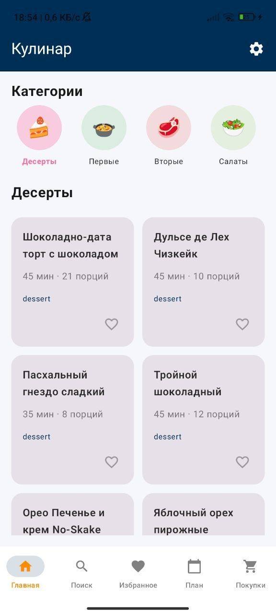
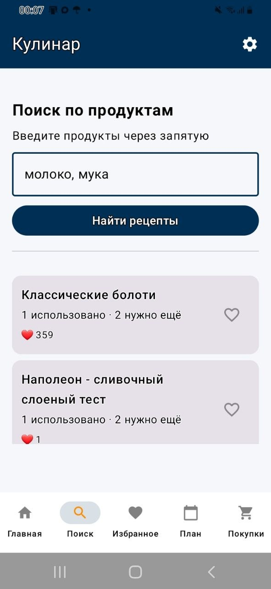
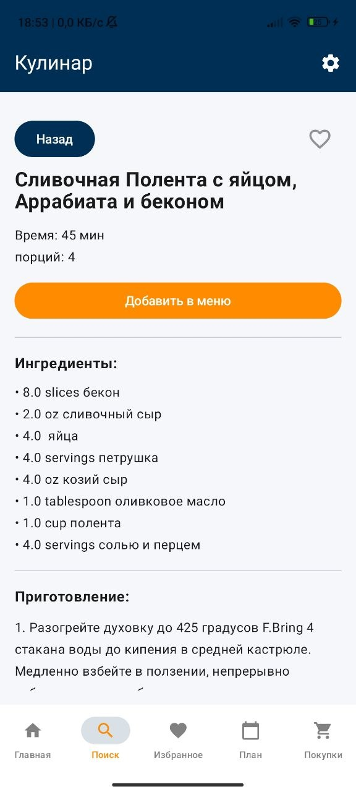
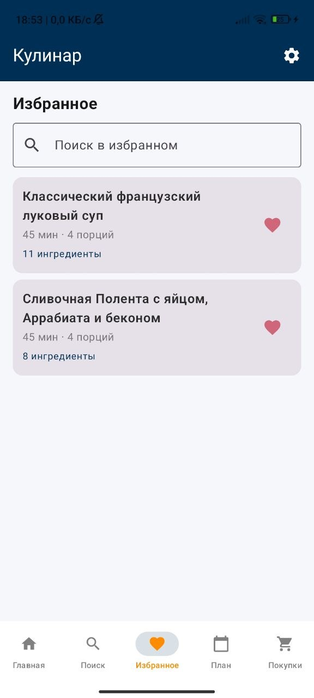
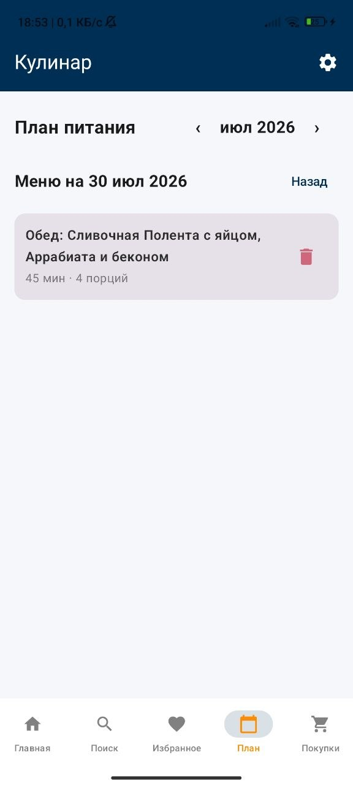
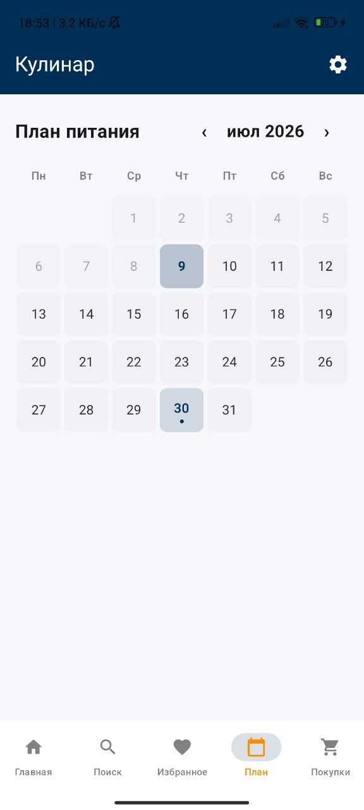
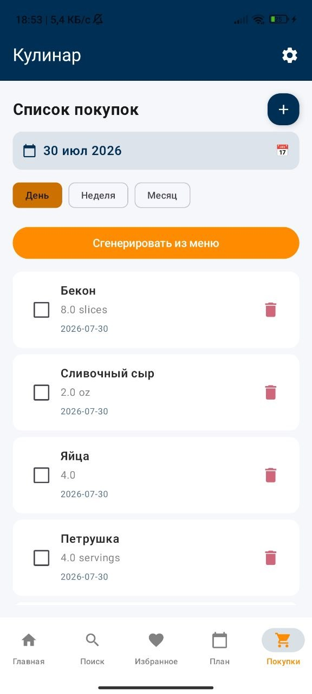
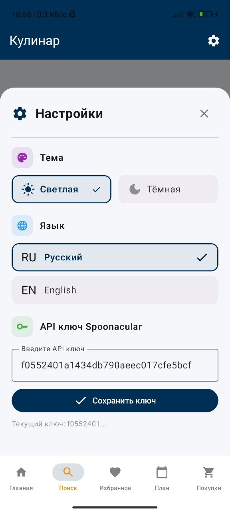

# Кулинар 🍳

Android-приложение для поиска рецептов, планирования меню и списка покупок. Написано на Kotlin с использованием Jetpack Compose.

## 📱 О приложении

«Кулинар» — учебный pet-проект, демонстрирующий навыки современной Android-разработки.

Приложение позволяет:
- осуществлять поиск рецептов по имеющимся продуктам;
- просматривать детальную информацию о рецептах;
- формировать персональный список избранных рецептов;
- планировать питание на неделю с наглядным календарным представлением;
- автоматически генерировать списки покупок на основе запланированных блюд;
- переключать язык интерфейса (русский / английский) мгновенно, без перезагрузки.

## 🛠 Технологии

| Категория | Стек |
|---|---|
| Язык | Kotlin |
| UI | Jetpack Compose, Material 3 |
| Архитектура | MVVM, ViewModel, StateFlow |
| Навигация | Navigation Compose |
| Сеть | Retrofit 2 + Gson, OkHttp Logging Interceptor |
| Изображения | Coil 3 |
| Локальное хранилище | DataStore Preferences |
| Перевод | ML Kit Translate |
| Асинхронность | Kotlin Coroutines |
| Сборка | Gradle (Kotlin DSL), AGP 9.2.1 |
| Min SDK | 30 |
| Target / Compile SDK | 36 / 37.1 |
| Java | 11 |

## 📲 Как запустить

Понадобится телефон на Android 11 (API 30) или новее.

Скачай APK-файл по ссылке: [app-debug.apk](https://github.com/DilyaraD/Culinara/blob/main/app-debug.apk)

Установи его на телефон (разреши установку из неизвестных источников, если потребуется) и запусти приложение.

## 🔑 API-ключ

Приложению нужен ключ Spoonacular API для поиска рецептов.
1. Зарегистрируйся на spoonacular.com и получи бесплатный ключ.
2. Открой приложение → Настройки → вставь ключ в поле «API ключ Spoonacular».
3. Нажми «Сохранить ключ» — после этого поиск рецептов заработает.

## 📖 Руководство пользователя

### Главный экран

При открытии приложения пользователь попадает на главный экран с категориями блюд и популярными рецептами. Вверху отображается название приложения «Кулинар», внизу — панель навигации для перехода между разделами.

Категории блюд отображаются в виде горизонтального списка с иконками-эмодзи и цветовой индикацией. При выборе категории список популярных рецептов фильтруется по типу блюда. Рецепты загружаются с Spoonacular API при первом запуске и кэшируются.

### Поиск

Для поиска рецептов необходимо перейти на вкладку «Поиск», ввести имеющиеся продукты через запятую в текстовое поле и нажать кнопку «Найти рецепты». Система отобразит список подходящих блюд с указанием количества использованных и недостающих ингредиентов.

Если запрос сделан на русском, система сначала переводит его на английский через ML Kit, затем отправляет в API.

### Детали рецепта

При нажатии на карточку рецепта открывается экран с полной информацией: название, время приготовления, количество порций, ингредиенты с количествами, пошаговые инструкции, тип блюда. Кнопка «Добавить в меню» позволяет сразу запланировать блюдо.

При открытии карточки система проверяет кэш переводов. Если полный перевод уже есть, показывает его мгновенно. Если нет — выполняет перевод в реальном времени.

### Избранное

На вкладке «Избранное» отображаются все сохранённые рецепты. Доступен поиск по названию. Для удаления рецепта из избранного необходимо нажать на красное сердечко.

При добавлении в избранное система сохраняет две независимые копии: оригинал на английском и перевод на русский. Это позволяет при смене языка интерфейса мгновенно переключать отображение без повторных обращений к API или переводчику.

### План питания

Вкладка «План» содержит календарь на месяц. Дни с запланированными блюдами помечены точкой. При выборе даты отображается список блюд на этот день, сгруппированных по приёмам пищи: завтрак, обед, полдник, ужин.

Добавление блюда в план происходит через диалог выбора даты и приёма пищи. В прошедшие даты добавление запрещено — они доступны только для просмотра. Каждая запись сохраняется в двух языковых версиях.

### Календарь

Календарь визуально выделяет дни с запланированными блюдами, текущий день и прошедшие даты.

### Список покупок

Вкладка «Покупки» позволяет формировать список продуктов двумя способами:

- **Автоматический:** пользователь выбирает период (день, неделя, месяц), система собирает ингредиенты из запланированных блюд и суммирует одинаковые продукты.
- **Ручной:** пользователь добавляет продукт самостоятельно с указанием названия, количества, единицы измерения и даты.

Каждый пункт можно отметить купленным (галочкой) или удалить. Отмеченные пункты визуально зачёркиваются.

### Настройки

Для открытия настроек необходимо нажать на значок шестерёнки в верхнем правом углу. Доступны три параметра:

- **Тема** — светлая или тёмная;
- **Язык** — русский или английский;
- **API-ключ Spoonacular** — ввод и сохранение ключа.

При смене языка или темы изменения применяются мгновенно, без перезапуска приложения.
